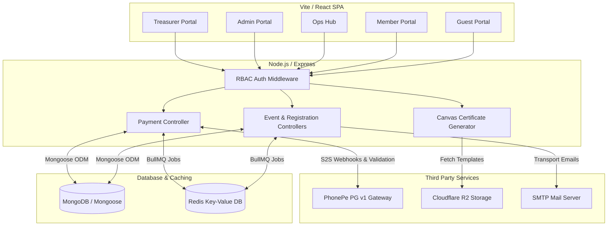
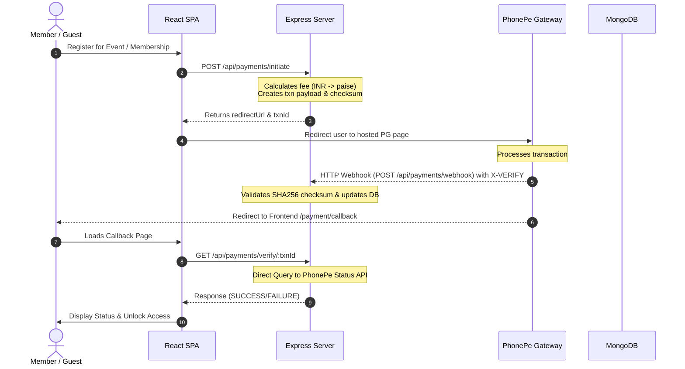
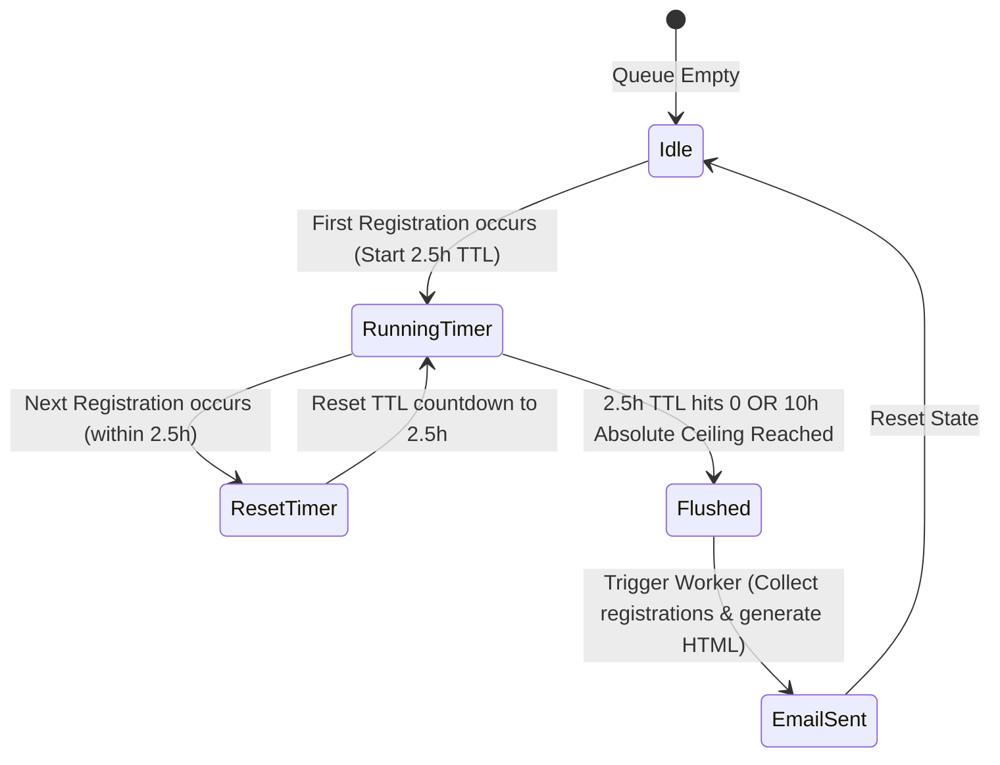

# ACE ERP
Platform for the **Association of Computer Engineers (ACE)**.  
Built on the MERN stack (MongoDB, Express, React, Node.js), powered by PhonePe PG v1, BullMQ + Redis, and a zero-storage headless canvas certificate engine.

---

## 1. System Overview & Portal Capabilities

ACE is partitioned into 5 distinct portals, each serving a specific role and set of capabilities.

### 1.1 Guest & Public Portal
**Target Audience:** Non-authenticated users, prospective members, and general event attendees.
- **Public Event Discovery:** View a catalog of upcoming and past events.
- **Event Registration & Checkout:** Register for events and purchase tickets through integrated payment gateways (Razorpay/PhonePe) as a guest.
- **Team Directory:** View public profiles of the Executive and Student Body Members.
- **Authentication Gateway:** Secure login and password recovery flows.
- **Membership Interest:** Submit forms to register interest in joining the organization.

### 1.2 Member Portal
**Target Audience:** Registered General Members.
- **Personal Dashboard:** A central hub displaying the member's dynamic ID card, upcoming registered events, and the latest organizational announcements.
- **Fast Check-in QR:** A personalized, dynamic QR code generated for rapid scanning at event entrances.
- **Event History (The Vault):** A detailed log of all previously attended events and activities.
- **Certificate Locker:** Access, unlock, and download dynamically generated certificates for completed events.
- **Profile Management:** Update personal contact information, academic details (branch, section, year), and social links.
- **Avatar Customization:** Upload and visually crop profile pictures directly within the portal.

### 1.3 Operations (Ops) Hub
**Target Audience:** Student Body Members (SBM), Executive Body Members (EBM), and System Admins.
- **Live Event Control Room:** A real-time dashboard used during active events to broadcast live announcements, monitor real-time check-in counts, and control event states (e.g., pausing registration).
- **QR Door Scanner:** A high-speed, camera-integrated scanning interface used by volunteers at event entrances to instantly validate member QR codes and log attendance.
- **Rapid Cash Registration:** An interface for volunteers to manually register attendees who are paying with physical cash at the door.
- **Instant Member Onboarding:** Quickly register completely new users into the system and instantly generate their official Member IDs on the spot.

### 1.4 System Administration (Admin) Portal
**Target Audience:** Executive Body Members (EBM) and System Admins.
- **Global Command Dashboard:** High-level metrics overview, including total revenue, active vs. draft events, total member counts, and active background system jobs.
- **Event Architect:** Create and configure new events. Features include setting pricing tiers, drafting descriptions, and building custom dynamic registration forms.
- **Registration Management:** Review all incoming event registrations, approve or reject pending requests, and filter data by specific events.
- **Certificate Forge:** A visual drag-and-drop builder for designing event certificates. Admins can upload base template images and position dynamic text nodes (like Name, Date, and Event Title) that automatically populate for each user.
- **User Directory & Access Control:** View the complete database of registered users. Admins can promote users to SBM/EBM roles or restrict access.
- **Mass Communications:** Send targeted push notifications or emails to specific cohorts.
- **System Settings:** Configure global platform variables, audit logs, and trigger emergency system modes.

### 1.5 Treasurer Analytics Portal
**Target Audience:** Users with the specific "Treasurer" designation.
- **Financial Overview:** Deep dive into the organization's revenue streams.
- **Payment Gateway Analysis:** Track funds captured online versus offline cash collections at the door.
- **Discrepancy Engine:** Automatically compare the expected revenue (based on scanned attendees) against the actual reported collections to highlight financial mismatches.
- **Automated Financial Digests:** A background engine that automatically compiles and emails comprehensive 10-hour financial reports to the Treasurer during active events.

---

## 2. System Architecture

The following diagrams illustrate the core structure, payment flows, and background queue mechanics.

### 2.1 Complete System Architecture Overview


### 2.2 Payment Initialization & Webhook Verification Flow


### 2.3 The Treasurer Digest Debounce Lifecycle


---

## 3. Project Directory Structure

```
Project-A/
├── server/                    # Express/Node.js backend (runs on :5000)
│   ├── .env.example           # Template for environment configuration
│   ├── src/
│   │   ├── index.js           # Express App & Server Startup Point (includes JWT guard)
│   │   ├── config/            # Third-party services integrations (Redis, etc.)
│   │   ├── models/            # Mongoose Schemas (User, Event, Registration, Transaction, Counter)
│   │   ├── routes/            # API Route Declarations (auth, admin, event, payment)
│   │   ├── controllers/       # Core Business Logic (auth, admin, event, payment controllers)
│   │   ├── middleware/        # Express Middlewares (auth validation, role checkers, error handlers)
│   │   ├── utils/             # Helper Modules (OTP generator, canvas helper, R2 fetcher)
│   │   ├── queues/            # BullMQ Job Producers (email queues, digest queues)
│   │   └── workers/           # BullMQ Consumers (digest worker, late converter worker)
│   └── package.json           # Backend dependency configuration
│
└── client/                    # React/Vite frontend (runs on :5173)
    ├── .env.example           # Template for client environment configuration
    ├── src/
    │   ├── App.jsx            # Main Router & Application Wrapper
    │   ├── main.jsx           # Vite Mount Point
    │   ├── index.css          # Cyber-Minimalism Tailwind Core Styles
    │   ├── components/        # Reusable UI widgets & Layout Layout wrappers
    │   ├── pages/             # Page components (Auth, Dashboard, Events, PaymentCallback)
    │   ├── store/             # Global State Management (useAuthStore, etc.)
    │   └── lib/               # Utility API layers and wrapper functions
    └── package.json           # Frontend dependency configuration
```

---

## 4. Tech Stack Specification

| Module / Layer | Technical Choice | Description |
|---|---|---|
| **Frontend Framework** | React 18 & Vite | Fast, client-side rendering with module replacement. |
| **Styling Engine** | Tailwind CSS v4 | Provides atomic utility classes tailored to theme variables. |
| **Theme / Font** | Industrial Cyber-Minimalism | JetBrains Mono font for technical data and a `#0B0F19` color scheme. |
| **Backend Engine** | Node.js (>=18.0.0) | Enforced runtime version for native fetch capabilities. |
| **Web Framework** | Express.js | Standard HTTP request pipeline and routing layer. |
| **Database Layer** | MongoDB & Mongoose | Document database for flexible schemas with strong models. |
| **Distributed Cache** | Upstash Redis | Serverless Redis with TLS — used as BullMQ message broker. |
| **Queue Manager** | BullMQ | Redis-backed robust asynchronous task runner (co-located in Express process). |
| **Payment Gateway** | PhonePe PG v1 | Secure redirect payment handling with verified callbacks. |
| **Email Delivery** | Resend (SMTP relay) | HTTP-based mail relay — bypasses Render SMTP port restrictions. |
| **Certificate Engine** | `@napi-rs/canvas` | Node canvas engine fetching assets to RAM (zero local storage). |
| **Image Storage** | Cloudflare R2 | S3-compatible template storage for blank certificates. |
| **Hosting (Backend)** | Render | Free-tier web service with auto-deploy from GitHub. |

---

## 5. Getting Started & Setup

### Prerequisites
* **Node.js:** `>= 18.0.0`
* **MongoDB:** Deployed instance or local connection string
* **Redis:** Deployed instance or local connection string

### 5.1 Backend Setup
1. Navigate to the backend directory:
   ```bash
   cd server
   ```
2. Copy the environment template and populate it with your actual credentials:
   ```bash
   cp .env.example .env
   ```
3. Install dependencies:
   ```bash
   npm install
   ```
4. Start the server in development mode:
   ```bash
   npm run dev
   ```
   The backend will launch at `http://localhost:5000`.

### 5.2 Frontend Setup
1. Navigate to the frontend directory:
   ```bash
   cd client
   ```
2. Copy the client-side environment template:
   ```bash
   cp .env.example .env
   ```
3. Install dependencies:
   ```bash
   npm install
   ```
4. Start the frontend development server:
   ```bash
   npm run dev
   ```
   The application will be accessible at `http://localhost:5173`.

---

## 6. Environment Variables Guide

The following configuration values are required in `server/.env` to achieve complete system functionality.

### Core Variables
* `NODE_ENV`: Either `development` or `production`. Under production mode, weak JWT secret values will trigger a safety startup guard.
* `MONGO_URI`: The MongoDB Atlas connection string (or local host URI).
* `REDIS_URL`: The Redis URI (e.g. `redis://127.0.0.1:6379`). Required by BullMQ.
* `JWT_SECRET`: Minimum 64-character hex key to secure session tokens.

### Payment Integration (PhonePe)
* `PHONEPE_MERCHANT_ID`: Your unique merchant identifier registered on PhonePe.
* `PHONEPE_SALT_KEY`: Salt key used to generate high-security payloads checksums.
* `PHONEPE_SALT_INDEX`: Salt index identifier matching your key registration.
* `PHONEPE_BASE_URL`: API gateway endpoint (Sandbox/UAT or Production URL).

### Cloudflare R2 Integration
* `R2_ACCOUNT_ID`: Cloudflare dashboard account ID.
* `R2_ACCESS_KEY_ID`: Restricted access key credentials.
* `R2_SECRET_ACCESS_KEY`: Secret string matching the access key.
* `R2_BUCKET_NAME`: Bucket hosting the base canvas certificate files.
* `R2_PUBLIC_URL`: Client-accessible endpoint to download or display base templates.

### Email Delivery (Resend)
Render's free tier **blocks SMTP ports 25, 465, and 587**. The backend uses Resend's SMTP relay, which tunnels over HTTPS (port 443) — never blocked by Render.
* `RESEND_API_KEY`: Your Resend API key (starts with `re_`). Get one free at [resend.com](https://resend.com).
* `EMAIL_FROM`: The sender address shown to recipients (must be on your verified Resend domain).

### Redis (Upstash)
* `REDIS_URL`: Use an Upstash `rediss://` URL (TLS) for production. Get a free instance at [upstash.com](https://upstash.com). Local dev uses `redis://127.0.0.1:6379`.

---

## 7. Security Policies & Best Practices

* **Atomic Database Counters:** Sequential ID generation executes using MongoDB's `$inc` operator within `findOneAndUpdate` commands. This avoids potential node race conditions.
* **Checksum Verification:** All callback integrations require standard SHA256 checksum checks utilizing base64 payloads to confirm identity before state changes occur in the database.
* **Production Password Protocol:** Deployed production systems automatically generate random passwords upon initial purchase and flag user credentials as `requiresPasswordChange: true`.
* **Fail-Fast Secret Check:** A startup validator verifies `JWT_SECRET` complexity when running under `production` mode, refusing to boot under weak keys.

---

## 8. Deploying to Render

The repository includes a [`render.yaml`](file:///Users/sriramcharannalla/Project-A/render.yaml) at the project root for one-click deployment.

### Prerequisites
* A [Render](https://render.com) account connected to your GitHub repository.
* A [MongoDB Atlas](https://cloud.mongodb.com) cluster (free M0 tier works).
* An [Upstash Redis](https://upstash.com) database (free tier — get `rediss://` connection URL).
* A [Resend](https://resend.com) account with a verified sending domain and API key.

### Steps

1. **Push `render.yaml`** to your `main` branch.
2. In the Render dashboard, click **New → Blueprint** and connect your repository.
3. Render will detect `render.yaml` and pre-fill the service configuration.
4. Fill in the `sync: false` environment variables in the Render dashboard:

   | Variable | Where to get it |
   |---|---|
   | `MONGO_URI` | MongoDB Atlas → Connect → Drivers |
   | `REDIS_URL` | Upstash dashboard → `rediss://` URL |
   | `RESEND_API_KEY` | Resend dashboard → API Keys |
   | `EMAIL_FROM` | e.g. `ACE ERP <noreply@yourdomain.com>` |
   | `PHONEPE_MERCHANT_ID` | PhonePe merchant dashboard |
   | `PHONEPE_SALT_KEY` | PhonePe merchant dashboard |
   | `CLIENT_URL` | Your deployed frontend URL (e.g. Vercel) |
   | `TREASURER_EMAIL` | Treasurer's email address |
   | `R2_ACCOUNT_ID / R2_ACCESS_KEY_ID / R2_SECRET_ACCESS_KEY / R2_PUBLIC_URL` | Cloudflare R2 dashboard |

5. `JWT_SECRET` is **auto-generated** by Render (`generateValue: true`) — no action needed.
6. Click **Apply** — Render builds and deploys the service.
7. Verify the deployment by hitting the health endpoint:
   ```
   GET https://<your-render-url>/api/health
   → { "success": true, "message": "ACE ERP Server is operational." }
   ```

> **Note on BullMQ workers:** Workers (email, treasurer digest, late converter) are co-located inside the Express process on the same Render web service. Render's `SIGTERM` is handled gracefully — workers complete in-flight jobs before shutdown.
