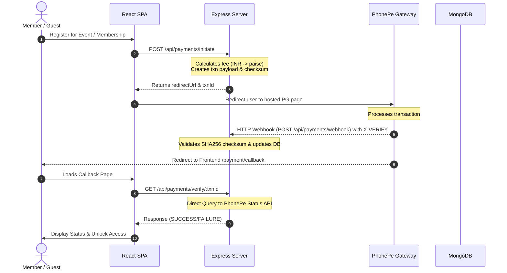
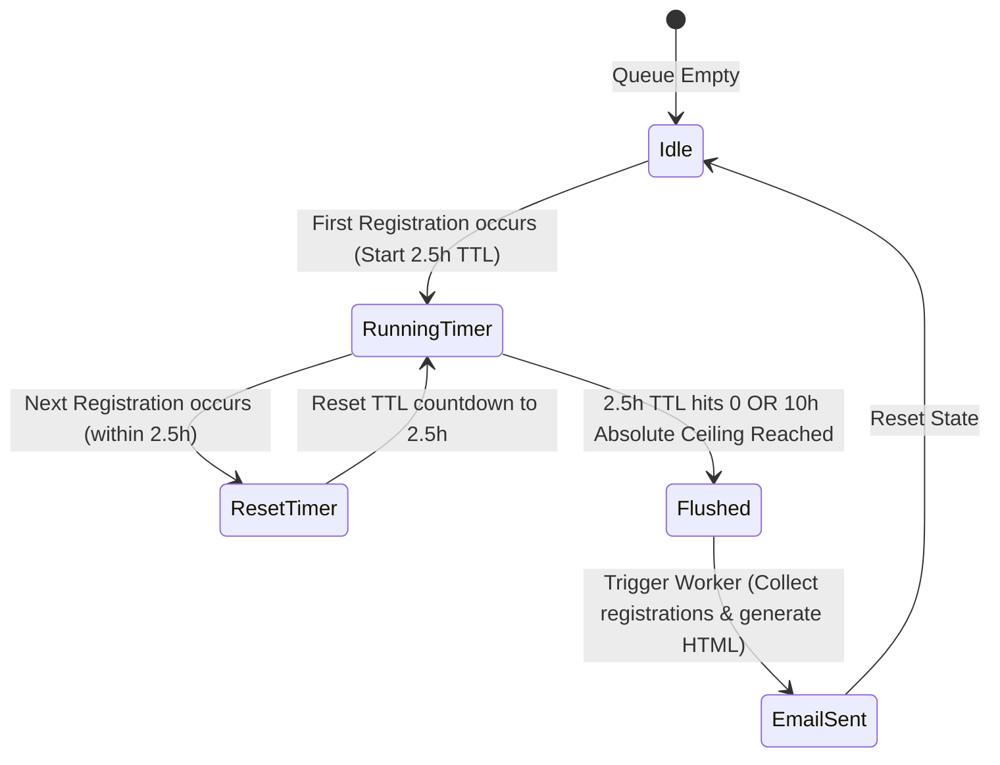

# ACE ERP

Enterprise Resource Planning (ERP) platform for the **Association of Computer Engineers (ACE)**.  
Built on the MERN stack (MongoDB, Express, React, Node.js), powered by PhonePe PG v1, BullMQ + Redis, and a zero-storage headless canvas certificate engine.

---

## 1. System Overview

ACE ERP manages role-based member directories, event registrations, automated billing, credentials vaults, and asynchronous email notifications. The platform operates on a secure backend system with a unified frontend designed in an **Industrial Cyber-Minimalism** theme.

### Key Functional Areas
* **RBAC & Identity Engine:** Manages levels from Guests and Members to Student Board Members (SBM), Executive Board Members (EBM), and Administrators. Members receive unique sequential IDs (`26ACE0___`) generated via an atomic MongoDB counters collection.
* **Dual-Tier Event Registrations:** Dynamically determines event pricing based on user role (Member vs. Non-Member) and tracks transaction status securely.
* **Server-Redirect PhonePe Payments:** Integrates PhonePe PG v1 redirect model. Verifies Razorpay-alternative webhooks using PhonePe's checksum mechanism (`X-VERIFY` header validation).
* **Asynchronous Jobs & Background Workers:** Processes deferred tasks through Redis-backed BullMQ queues. This includes:
  - **10-Hour Treasurer Digest:** Gathers event registrations and emails a consolidated digest to the Treasurer.
  - **Late Converter Migration:** Back-ports a guest's historical event registrations and certificates to their permanent Member Vault when they purchase a full membership.
* **Zero-Storage headless Certificate Renderer:** Fetches base blank certificate templates to RAM from Cloudflare R2, applies high-resolution text overlays dynamically using `@napi-rs/canvas` based on event metrics, and streams the buffer directly to the client.

---

## 2. System Architecture

The following diagrams illustrate the core structure, payment flows, and background queue mechanics.

### 2.1 Complete System Architecture Overview
```mermaid
graph TD
    subgraph Client Layer
        Vite[React SPA / Vite]
    end

    subgraph Application Server
        Express[Express.js Server / Node.js 18+]
        Canvas[@napi-rs/canvas Engine]
    end

    subgraph Database & Caching
        Mongo[(MongoDB / Mongoose)]
        Redis[(Redis Key-Value DB)]
    end

    subgraph Third Party Services
        PhonePe[PhonePe PG v1 Gateway]
        R2[Cloudflare R2 Storage]
        SMTP[SMTP Mail Server]
    end

    Vite <--> |HTTPS / JSON API| Express
    Express <--> |Mongoose ODM| Mongo
    Express <--> |BullMQ Queues| Redis
    Express --> |Fetch Base Templates| R2
    Express --> |Stream Buffer| Vite
    Express <--> |PG Redirect & Status API| PhonePe
    Express --> |Transports Emails| SMTP
```

### 2.2 Payment Initialization & Webhook Verification Flow


### 2.3 The Treasurer Digest Debounce Lifecycle


---

## 3. Project Directory Structure

```
Project-A/
├── server/                    # Express/Node.js backend (runs on :5000)
│   ├── .env.example           # Template for environment configuration
│   ├── src/
│   │   ├── index.js           # Express App & Server Startup Point (includes JWT guard)
│   │   ├── config/            # Third-party services integrations (Redis, etc.)
│   │   ├── models/            # Mongoose Schemas (User, Event, Registration, Transaction, Counter)
│   │   ├── routes/            # API Route Declarations (auth, admin, event, payment)
│   │   ├── controllers/       # Core Business Logic (auth, admin, event, payment controllers)
│   │   ├── middleware/        # Express Middlewares (auth validation, role checkers, error handlers)
│   │   ├── utils/             # Helper Modules (OTP generator, canvas helper, R2 fetcher)
│   │   ├── queues/            # BullMQ Job Producers (email queues, digest queues)
│   │   └── workers/           # BullMQ Consumers (digest worker, late converter worker)
│   └── package.json           # Backend dependency configuration
│
└── client/                    # React/Vite frontend (runs on :5173)
    ├── .env.example           # Template for client environment configuration
    ├── src/
    │   ├── App.jsx            # Main Router & Application Wrapper
    │   ├── main.jsx           # Vite Mount Point
    │   ├── index.css          # Cyber-Minimalism Tailwind Core Styles
    │   ├── components/        # Reusable UI widgets & Layout Layout wrappers
    │   ├── pages/             # Page components (Auth, Dashboard, Events, PaymentCallback)
    │   ├── store/             # Global State Management (useAuthStore, etc.)
    │   └── lib/               # Utility API layers and wrapper functions
    └── package.json           # Frontend dependency configuration
```

---

## 4. Tech Stack Specification

| Module / Layer | Technical Choice | Description |
|---|---|---|
| **Frontend Framework** | React 18 & Vite | Fast, client-side rendering with module replacement. |
| **Styling Engine** | Tailwind CSS v4 | Provides atomic utility classes tailored to theme variables. |
| **Theme / Font** | Industrial Cyber-Minimalism | JetBrains Mono font for technical data and a `#0B0F19` color scheme. |
| **Backend Engine** | Node.js (>=18.0.0) | Enforced runtime version for native fetch capabilities. |
| **Web Framework** | Express.js | Standard HTTP request pipeline and routing layer. |
| **Database Layer** | MongoDB & Mongoose | Document database for flexible schemas with strong models. |
| **Distributed Cache** | Redis | Message broker for storing background jobs and state. |
| **Queue Manager** | BullMQ | Redis-backed robust asynchronous task runner. |
| **Payment Gateway** | PhonePe PG v1 | Secure redirect payment handling with verified callbacks. |
| **Certificate Engine** | `@napi-rs/canvas` | Node canvas engine fetching assets to RAM (zero local storage). |
| **Image Storage** | Cloudflare R2 | S3-compatible template storage for blank certificates. |

---

## 5. Getting Started & Setup

### Prerequisites
* **Node.js:** `>= 18.0.0`
* **MongoDB:** Deployed instance or local connection string
* **Redis:** Deployed instance or local connection string

### 5.1 Backend Setup
1. Navigate to the backend directory:
   ```bash
   cd server
   ```
2. Copy the environment template and populate it with your actual credentials:
   ```bash
   cp .env.example .env
   ```
3. Install dependencies:
   ```bash
   npm install
   ```
4. Start the server in development mode:
   ```bash
   npm run dev
   ```
   The backend will launch at `http://localhost:5000`.

### 5.2 Frontend Setup
1. Navigate to the frontend directory:
   ```bash
   cd client
   ```
2. Copy the client-side environment template:
   ```bash
   cp .env.example .env
   ```
3. Install dependencies:
   ```bash
   npm install
   ```
4. Start the frontend development server:
   ```bash
   npm run dev
   ```
   The application will be accessible at `http://localhost:5173`.

---

## 6. Environment Variables Guide

The following configuration values are required in `server/.env` to achieve complete system functionality.

### Core Variables
* `NODE_ENV`: Either `development` or `production`. Under production mode, weak JWT secret values will trigger a safety startup guard.
* `MONGO_URI`: The MongoDB Atlas connection string (or local host URI).
* `REDIS_URL`: The Redis URI (e.g. `redis://127.0.0.1:6379`). Required by BullMQ.
* `JWT_SECRET`: Minimum 64-character hex key to secure session tokens.

### Payment Integration (PhonePe)
* `PHONEPE_MERCHANT_ID`: Your unique merchant identifier registered on PhonePe.
* `PHONEPE_SALT_KEY`: Salt key used to generate high-security payloads checksums.
* `PHONEPE_SALT_INDEX`: Salt index identifier matching your key registration.
* `PHONEPE_BASE_URL`: API gateway endpoint (Sandbox/UAT or Production URL).

### Cloudflare R2 Integration
* `R2_ACCOUNT_ID`: Cloudflare dashboard account ID.
* `R2_ACCESS_KEY_ID`: Restricted access key credentials.
* `R2_SECRET_ACCESS_KEY`: Secret string matching the access key.
* `R2_BUCKET_NAME`: Bucket hosting the base canvas certificate files.
* `R2_PUBLIC_URL`: Client-accessible endpoint to download or display base templates.

### SMTP Settings
* `SMTP_HOST`: Host address of your email gateway (e.g. `smtp.gmail.com`).
* `SMTP_PORT`: Port configuration (`587` or `465`).
* `SMTP_USER`: Standard email account name.
* `SMTP_PASS`: Application password corresponding to the email login.

---

## 7. Security Policies & Best Practices

* **Atomic Database Counters:** Sequential ID generation executes using MongoDB's `$inc` operator within `findOneAndUpdate` commands. This avoids potential node race conditions.
* **Checksum Verification:** All callback integrations require standard SHA256 checksum checks utilizing base64 payloads to confirm identity before state changes occur in the database.
* **Production Password Protocol:** Deployed production systems automatically generate random passwords upon initial purchase and flag user credentials as `requiresPasswordChange: true`.
* **Fail-Fast Secret Check:** A startup validator verifies `JWT_SECRET` complexity when running under `production` mode, refusing to boot under weak keys.
